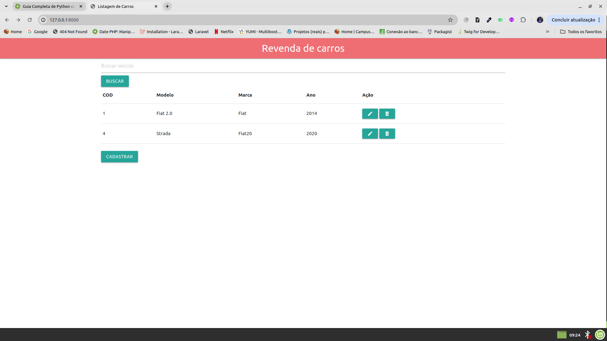
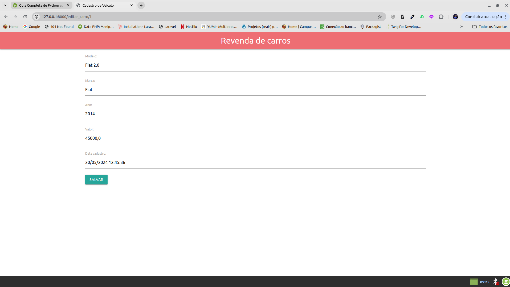
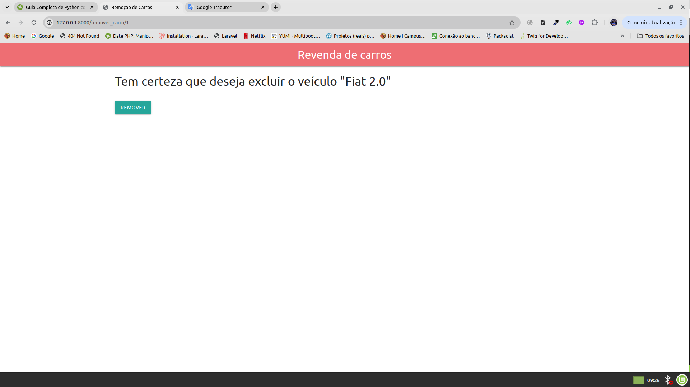

# Projeto Cadastro de Veículos

Este é um projeto Django de cadastro de veículos com Python 3. Ele permite que você gerencie informações sobre veículos, incluindo modelo, marca e ano, entre outras.

## Funcionalidades

- **Listagem de veículo:** Exibe uma lista de todos os veículos cadastrados no sistema.
- **Criação de veículo:** Permite adicionar novos veículos ao sistema.
- **Edição de veículo:** Permite editar informações de veículos existentes.
- **Exclusão de veículo:** Permite remover um veículo do sistema.

## Instalação

1. Clone o repositório:
   git clone https://github.com/pedro162/CadastroVeiculosProject.git

2. Instale as dependências:
   pip install -r requirements.txt

## Uso

1. Inicie o servidor Django:
   python manage.py runserver

2. Acesse o aplicativo em seu navegador: [http://localhost:8000/](http://localhost:8000/)

## Páginas

### Listagem de veículos

- Exibe uma lista de todos os veículos cadastrados.
- Permite visualizar detalhes de cada veículo.
- Fornece opções para editar e excluir cada veículo.

### Cadastro de veículo

- Permite adicionar novos veículos ao sistema.
- Formulário com campos para inserir modelo, marca e ano do veículo.

### Atualização de veículo

- Permite editar informações de veículos existentes.
- Formulário pré-preenchido com os detalhes do veículo selecionado.

### Excluisão de veículo

- Permite excluir um veículo existente.
- Fornece detalhes do veículo selecionado.

## Contribuição

Sinta-se à vontade para contribuir com este projeto! Se encontrar algum bug ou tiver alguma melhoria, por favor, abra uma issue ou envie um pull request.

## Licença

Este projeto está licenciado sob a Licença MIT. Consulte o arquivo [LICENSE](LICENSE) para obter detalhes.
